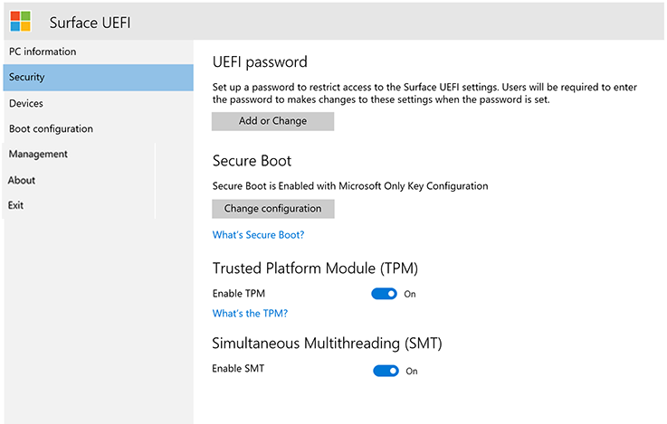

# Gestire le impostazioni UEFI di SurfaceManage Surface UEFI settings

Tutte le generazioni correnti e future dei dispositivi Surface usano un'interfaccia UEFI (Unified Extensible Firmware Interface) univoca progettata da Microsoft in modo specifico per questi dispositivi.All current and future generations of Surface devices use a unique Unified Extensible Firmware Interface (UEFI) engineered by Microsoft specifically for these devices. Le impostazioni di Surface UEFI offrono la possibilità di abilitare o disabilitare dispositivi e componenti incorporati, proteggere le impostazioni UEFI e modificare le impostazioni di avvio del dispositivo Surface.Surface UEFI settings provide the ability to enable or disable built-in devices and components, protect UEFI settings from being changed, and adjust the Surface device boot settings. 

## Supporto per la gestione basata sul cloudSupport for cloud-based management

Con i profili di DFCI (device firmware Configuration Interface) incorporati in Microsoft Intune (ora disponibile in anteprima pubblica), Surface UEFI Management estende il moderno stack di gestione fino al livello hardware UEFI.With Device Firmware Configuration Interface (DFCI) profiles built into Microsoft Intune (now available in public preview), Surface UEFI management extends the modern management stack down to the UEFI hardware level. DFCI supporta il provisioning a zero tocco, Elimina le password del BIOS, fornisce il controllo delle impostazioni di sicurezza, incluse le opzioni di avvio e le periferiche predefinite, e stabilisce le basi per scenari di sicurezza avanzati in futuro.DFCI supports zero-touch provisioning, eliminates BIOS passwords, provides control of security settings including boot options and built-in peripherals, and lays the groundwork for advanced security scenarios in the future. DFCI è attualmente disponibile per Surface Pro 7, Surface Pro X e Surface laptop 3.DFCI is currently available for Surface Pro 7, Surface Pro X, and Surface Laptop 3. Per altre informazioni, vedere [gestione di Intune delle impostazioni di Surface UEFI](surface-manage-dfci-guide.md).For more information, refer to [Intune management of Surface UEFI settings](surface-manage-dfci-guide.md).

## Menu open Surface UEFIOpen Surface UEFI menu

Per regolare le impostazioni UEFI durante l'avvio del sistema:To adjust UEFI settings during system startup:

1. Chiudere la superficie e attendere circa 10 secondi per verificare che sia disattivata.Shut down your Surface and wait about 10 seconds to make sure it's off.
2. Premere e tenere premuto il pulsante **volume-up** e-allo stesso tempo-premere e rilasciare il **pulsante di accensione.**Press and hold the **Volume-up** button  and - at the same time - press and release the **Power button.**
3. Quando sullo schermo compare il logo Microsoft o Surface, continuare a tenere premuto il pulsante **volume-up** finché non viene visualizzata la schermata UEFI.As the Microsoft or Surface logo appears on your screen, continue to hold the **Volume-up** button until the UEFI screen appears.

## Pagina informazioni PC UEFIUEFI PC information page

La pagina informazioni PC include informazioni dettagliate sul dispositivo Surface:The PC information page includes detailed information about your Surface device: 

- **Modello** : il modello del dispositivo Surface verrà visualizzato qui, ad esempio Surface Book 2 o Surface Pro 7.**Model** – Your Surface device’s model will be displayed here, such as Surface Book 2 or Surface Pro 7. L'esatta configurazione del dispositivo non viene visualizzata, ad esempio processore, dimensioni dei dischi o dimensioni della memoria.The exact configuration of your device is not shown, (such as processor, disk size, or memory size). 
- **UUID**: codice Universally Unique Identification specifico del dispositivo e usato per identificare il dispositivo durante la distribuzione o la gestione.**UUID** – This Universally Unique Identification number is specific to your device and is used to identify the device during deployment or management. 

- **Serial Number**: numero usato per identificare questo dispositivo Surface specifico per gli scenari di tag asset e supporto.**Serial Number** – This number is used to identify this specific Surface device for asset tagging and support scenarios.
- **Asset Tag**: tag asset assegnato al dispositivo Surface tramite [Asset Tag Tool](https://docs.microsoft.com/surface/assettag).**Asset Tag** – The asset tag is assigned to the Surface device with the [Asset Tag Tool](https://docs.microsoft.com/surface/assettag). 

Qui troverai anche informazioni dettagliate sul firmware del tuo dispositivo Surface.You will also find detailed information about the firmware of your Surface device. I dispositivi Surface hanno svariati componenti interni, ognuno dei quali esegue versioni diverse del firmware.Surface devices have several internal components that each run different versions of firmware. La versione del firmware di ognuno dei dispositivi seguenti viene visualizzata nella pagina **PC information** (mostrata nella figura 1):The firmware version of each of the following devices is displayed on the **PC information** page (as shown in Figure 1): 

- UEFI di sistemaSystem UEFI 

- Controller SAMSAM Controller 

- Intel Management EngineIntel Management Engine 

- Controller integrato di sistemaSystem Embedded Controller 

- Firmware per il toccoTouch Firmware 

*Figura 1.Figure 1. Informazioni di sistema e informazioni sulla versione del firmwareSystem information and firmware version information*

Puoi trovare informazioni aggiornate sulla versione più recente del firmware per il dispositivo Surface nella pagina [Surface Update History](https://www.microsoft.com/surface/support/install-update-activate/surface-update-history) per il tuo dispositivo.You can find up-to-date information about the latest firmware version for your Surface device in the [Surface Update History](https://www.microsoft.com/surface/support/install-update-activate/surface-update-history) for your device. 

## Pagina sicurezza UEFIUEFI Security page 

*Figura 2.Figure 2. Configurazione delle impostazioni di sicurezza UEFI di SurfaceConfigure Surface UEFI security settings*

La pagina sicurezza consente di impostare una password per la protezione delle impostazioni UEFI.The Security page allows you to set a password to protect UEFI settings. Questa password deve essere immessa quando avvii il dispositivo Surface in UEFI.This password must be entered when you boot the Surface device to UEFI. La password può contenere i caratteri seguenti (come illustrato nella figura 3):The password can contain the following characters (as shown in Figure 3): 

- Lettere maiuscole: A-ZUppercase letters: A-Z 

- Lettere minuscole: a-zLowercase letters: a-z 

- Numeri: 1-0Numbers: 1-0 

- Caratteri speciali:! @ # $% ^& \* ()? <>{} []-_ = + |.,;:'' "Special characters: !@#$%^&\*()?<>{}[]-_=+|.,;:’\`” 

La password deve contenere almeno 6 caratteri e fa distinzione tra maiuscole e minuscole.The password must be at least 6 characters and is case sensitive. 

*Figura 3.Figure 3. Aggiunta di una password per proteggere le impostazioni UEFI di SurfaceAdd a password to protect Surface UEFI settings*

Nella pagina Security puoi anche modificare la configurazione di Avvio protetto nel tuo dispositivo Surface.On the Security page you can also change the configuration of Secure Boot on your Surface device. La tecnologia Avvio protetto impedisce l'avvio di un codice di avvio non autorizzato nel dispositivo Surface, per proteggere il sistema da infezioni malware di tipo bootkit e rootkit.Secure Boot technology prevents unauthorized boot code from booting on your Surface device, which protects against bootkit and rootkit-type malware infections. Puoi disabilitare Avvio protetto per permettere al dispositivo Surface di avviare sistemi operativi o supporti di avvio di terze parti.You can disable Secure Boot to allow your Surface device to boot third-party operating systems or bootable media. È anche possibile configurare l'avvio sicuro per l'utilizzo con certificati di terze parti, come illustrato nella figura 4.You can also configure Secure Boot to work with third-party certificates, as shown in Figure 4. Per altre informazioni, vedi [Avvio protetto](https://msdn.microsoft.com/windows/hardware/commercialize/manufacture/desktop/secure-boot-overview) nella Libreria TechNet.Read more about [Secure Boot](https://msdn.microsoft.com/windows/hardware/commercialize/manufacture/desktop/secure-boot-overview) in the TechNet Library.

*Figura 4.Figure 4. Configurazione di Avvio protettoConfigure Secure Boot*

A seconda del dispositivo, potrebbe essere anche possibile verificare se il TPM è abilitato o disabilitato.Depending on your device, you may also be able to see if your TPM is enabled or disabled. Se l'impostazione **Abilita TPM** non è visibile, aprire TPM. msc in Windows per verificare lo stato, come illustrato nella figura 5.If you do not see the **Enable TPM**  setting, open tpm.msc in Windows to check the status, as shown in Figure 5. Il dispositivo TPM viene usato per autenticare la crittografia per i dati del dispositivo con BitLocker.The TPM is used to authenticate encryption for your device’s data with BitLocker. Per altre informazioni, vedere [Cenni preliminari su BitLocker](https://docs.microsoft.com/windows/security/information-protection/bitlocker/bitlocker-overview).To learn more, see [BitLocker overview](https://docs.microsoft.com/windows/security/information-protection/bitlocker/bitlocker-overview). 

*Figura 5.Figure 5. Console TPMTPM console*

## Menu UEFI: dispositiviUEFI menu: Devices 

La pagina dispositivi consente di abilitare o disabilitare dispositivi e componenti specifici, tra cui:The Devices page allows you to  enable or disable specific devices and components including:

- Alloggiamento di espansione e porte USBDocking and USB Ports 

- Slot per scheda microSD o SDMicroSD or SD Card Slot 

- Fotocamera posterioreRear Camera 

- Fotocamera anterioreFront Camera 

- Fotocamera a infrarossiInfrared (IR) Camera 

- Wi-Fi e BluetoothWi-Fi and Bluetooth 

- Audio integrato (altoparlanti e microfono)Onboard Audio (Speakers and Microphone) 

Ogni dispositivo è elencato con un **pulsante di scorrimento che consente di spostare** la posizione **attivato (abilitato) o disattivato** (disabilitato), come illustrato nella figura 6.Each device is listed with a slider button that you can move to **On** (enabled) or **Off** (disabled) position, as shown in Figure 6. 

*Figura 6.Figure 6. Abilitazione e disabilitazione di dispositivi specificiEnable and disable specific devices*

## Menu UEFI: configurazione di avvioUEFI menu: Boot configuration 

La pagina Configurazione di avvio consente di modificare l'ordine dei dispositivi di avvio e di abilitare o disabilitare l'avvio dei dispositivi seguenti:The Boot Configuration page allows you to change the order of your boot devices as well as enable or disable boot of the following devices: 

- Windows Boot ManagerWindows Boot Manager 

- Archiviazione USBUSB Storage 

- Rete PXEPXE Network 

- Archiviazione internaInternal Storage 

Puoi eseguire l'avvio da un dispositivo specifico immediatamente oppure puoi scorrere rapidamente verso sinistra sulla voce del dispositivo nell'elenco usando il touchscreen.You can boot from a specific device immediately, or you can swipe left on that device’s entry in the list using the touchscreen. Puoi anche eseguire l'avvio immediatamente da un dispositivo USB o da una scheda Ethernet USB quando il dispositivo Surface è spento premendo il pulsante di **riduzione del volume** e quello di **accensione** simultaneamente.You can also boot immediately to a USB device or USB Ethernet adapter when the Surface device is powered off by pressing the **Volume Down** button and the **Power** button simultaneously. 

Per rendere effettivo l'ordine di avvio specificato, è necessario impostare l'opzione **Attiva sequenza di avvio alternativo** **su**attivato, come illustrato nella figura 7.For the specified boot order to take effect, you must set the **Enable Alternate Boot Sequence** option to **On**, as shown in Figure 7. 

*Figura 7.Figure 7. Configurazione dell'ordine di avvio per il dispositivo SurfaceConfigure the boot order for your Surface device* 

Poi anche attivare o disattivare il supporto IPv6 per PXE con l'opzione **Enable IPv6 for PXE Network Boot**, ad esempio quando esegui una distribuzione di Windows con PXE in cui il server PXE è configurato solo per IPv4.You can also turn on and off IPv6 support for PXE with the **Enable IPv6 for PXE Network Boot** option, for example when performing a Windows deployment using PXE where the PXE server is configured for IPv4 only.  

## Menu UEFI: gestioneUEFI menu: Management
La pagina di gestione consente di gestire l'uso della gestione delle funzioni di zero touch UEFI e di altre funzionalità nei dispositivi idonei, tra cui Surface Pro 7, Surface Pro X e Surface laptop 3.The Management page allows you to manage use of Zero Touch UEFI Management and other features on eligible devices including Surface Pro 7, Surface Pro X, and Surface Laptop 3.  

 *Figura 8. Gestire l'accesso alla gestione di zero touch UEFI e ad altre caratteristiche*Manage access to Zero Touch UEFI Management and other features](images/manage-surface-uefi-fig7a.png "Manage access to Zero Touch UEFI Management and other features")
*Figure 8. Manage access to Zero Touch UEFI Management and other features* 

Zero Touch UEFI Management consente di gestire in remoto le impostazioni UEFI usando un profilo di dispositivo all'interno di Intune denominato device firmware Configuration Interface (DFCI).Zero Touch UEFI Management lets you remotely manage UEFI settings  by using a device profile within Intune called Device Firmware Configuration Interface (DFCI). Se non si configura questa impostazione, la possibilità di gestire i dispositivi idonei con DFCI è impostata su **pronto**.If you do not configure this setting, the ability to manage eligible devices with DFCI is set to **Ready**. Per evitare DFCI, selezionare **opt-out**.To prevent DFCI, select **Opt-Out**. 

> [!NOTE]
> La pagina delle impostazioni di gestione UEFI e l'uso di DFCI sono disponibili solo in Surface Pro 7, Surface Pro X e Surface laptop 3.The UEFI Management settings page and use of DFCI is only available on Surface Pro 7, Surface Pro X, and Surface Laptop 3.  

Per altre informazioni, vedere [gestione di Intune delle impostazioni di Surface UEFI](surface-manage-dfci-guide.md).For more information, refer to [Intune management of Surface UEFI settings](surface-manage-dfci-guide.md).

## Menu UEFI: EsciUEFI menu: Exit 

Usare il pulsante **Riavvia ora** nella pagina **Esci** per uscire dalle impostazioni di UEFI, come illustrato nella figura 9.Use the **Restart Now** button on the **Exit** page to exit UEFI settings, as shown in Figure 9. 

*Figura 9.Figure 9. Fai clic su Riavvia ora per uscire dalle impostazioni UEFI di Surface e riavviare il dispositivoClick Restart Now to exit Surface UEFI and restart the device*

## Schermate di avvio UEFI di SurfaceSurface UEFI boot screens

Quando aggiorni il firmware del dispositivo Surface, tramite Windows Update o un'installazione manuale, gli aggiornamenti non vengono applicati immediatamente al dispositivo, ma al successivo ciclo di riavvio.When you update Surface device firmware, by using either Windows Update or manual installation, the updates are not applied immediately to the device, but instead during the next reboot cycle. Puoi trovare ulteriori informazioni sul processo di aggiornamento del firmware di Surface in [Gestire gli aggiornamenti di driver e firmware Surface](https://docs.microsoft.com/surface/manage-surface-pro-3-firmware-updates).You can find out more about the Surface firmware update process in [Manage Surface driver and firmware updates](https://docs.microsoft.com/surface/manage-surface-pro-3-firmware-updates). Lo stato di avanzamento dell'aggiornamento del firmware viene visualizzato su uno schermo con barre di stato di colori diversi per indicare il firmware di ogni componente.The progress of the firmware update is displayed on a screen with progress bars of differing colors to indicate the firmware for each component. La barra di stato di ogni componente viene visualizzata nelle figure da 9 a 18.Each component’s progress bar is shown in Figures 9 through 18.

*Figura 10.Figure 10. L'aggiornamento del firmware UEFI di Surface visualizza una barra di stato bluThe Surface UEFI firmware update displays a blue progress bar*

*Figura 11.Figure 11. L'aggiornamento del firmware del controller integrato di sistema visualizza una barra di stato verdeThe System Embedded Controller firmware update displays a green progress bar*

*Figura 12.Figure 12. L'aggiornamento del firmware del controller SAM visualizza una barra di stato arancioneThe SAM Controller firmware update displays an orange progress bar*

*Figura 13.Figure 13. L'aggiornamento del firmware Intel Management Engine visualizza una barra di stato rossaThe Intel Management Engine firmware update displays a red progress bar*

*Figura 14.Figure 14. L'aggiornamento del firmware di Surface touch visualizza una barra di stato grigiaThe Surface touch firmware update displays a gray progress bar*

*Figura 15.Figure 15. L'aggiornamento del firmware di Surface KIP Visualizza una barra di stato verde chiaroThe Surface KIP firmware update displays a light green progress bar*

*Figura 16 la superficie dell'aggiornamento del firmware ISH Mostra una barra di avanzamento rosa chiaroFigure 16 The Surface ISH firmware update displays a light pink progress bar*

*Figura 17.Figure 17. L'aggiornamento del firmware Surface trackpad Visualizza una barra di stato rosaThe Surface Trackpad firmware update displays a pink progress bar*

*Figura 18.Figure 18. L'aggiornamento del firmware Surface TCON Visualizza una barra di stato grigio chiaroThe Surface TCON firmware update displays a light gray progress bar*

*Figura 19.Figure 19. L'aggiornamento del firmware Surface TPM Visualizza una barra di stato violaThe Surface TPM firmware update displays a purple progress bar*

>[!NOTE]
>Viene visualizzato un messaggio di avviso aggiuntivo che indica che l'avvio sicuro è disabilitato, come illustrato nella figura 19.An additional warning message that indicates Secure Boot is disabled is displayed, as shown in Figure 19.

*Figura 20.Figure 20. Schermata di avvio di Surface indicante che l'avvio protetto è stato disabilitato nelle impostazioni UEFI di SurfaceSurface boot screen that indicates Secure Boot has been disabled in Surface UEFI settings*

## Argomenti correlatiRelated topics

- [Gestione di Intune delle impostazioni UEFI di SurfaceIntune management of Surface UEFI settings](surface-manage-dfci-guide.md)

-  [Surface Enterprise Management ModeSurface Enterprise Management Mode](surface-enterprise-management-mode.md)
